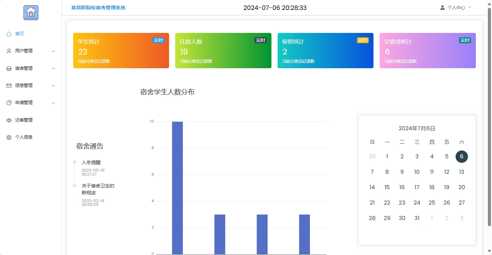

# Dormitory_business

#### 介绍

学生宿舍管理系统

#### 软件架构

软件架构说明 springboot+vue mysql

#### 安装教程

1. 效果图
   

#### 使用说明

1. 关注陆小马公众号获取sql文件，创建数据库，运行sql，或者联系我远程部署调试
   sql文件地址：https://mbd.pub/o/bread/ZpiUlJdv
3. idea打开项目，修改数据库用户名密码
4. vue 前端v16.20.2
5. 联系:定制开发各种软件系统网站app等等

   

   定制python、java、c、c++、app、html、计算机相关作业、软件网站代写指导帮忙、电脑提速优化 请私信公号中提醒联系协商时间等

   如有需要请提前准备远程连接软件 ToDesk官网下载或网盘下载ToDesk_4.7.2.1

   链接：https://pan.baidu.com/s/1AkZ8DGP5dbDeU7naH6v7Gw?pwd=1024
   提取码：1024

   开发环境 JDK1.8 or 11 IntelliJ IDEA Maven tomcat Node.js -v16.20.2 Redis MySQL 5.7or8 微信开发者工具 AndroidStudio navcat

   资源获取渠道说明：

   百度搜blotemj不迷路
   
   公号众、b站：陆小马 
   
   CSDN博客：https://blotemj.blog.csdn.net/
   
   面包多：https://mbd.pub/o/blotemj

   更新一些资料，录一些相关视频均在以上平台发布敬请期待。。。

#### 参与贡献

1. Fork 本仓库
2. 新建 Feat_xxx 分支
3. 提交代码
4. 新建 Pull Request
